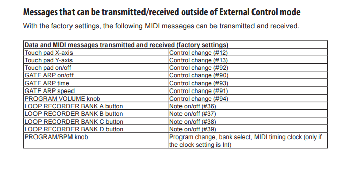

# MIDI input for  Korg Kaossilator

This is a arduino based midi converter for the Kaossilator pro.  It takes the midi from a midi device "keyboard" and converts it into the format that the Kaossilator is looking for.  The keyboard primarly produces Note Off and Note On messages and the Korg is looking for specific Control messages.  This is a modified project that was orginaly designed for a [teensy](https://karg-music.blogspot.com/2015/11/play-kaossilator-pro-with-standard-midi.html).

### Dependancy's 
* [AltSoftSerial](https://github.com/PaulStoffregen/AltSoftSerial)  - Normal softwareSerial doesn't like the weird speed of 31250 that midi requires.  You should be able to grab this from the arduino package manager.

## List of things that can be controller from MIDI IN

To use the MIDI in port you need to put your device into midi mode "mode 4". These  These are the default setting for each of the commands that can be controlled by midi input, but these can be overwritten which i'll explain after this image.

## Configure midi settings

### Change channel

* ([Shift] + [Mode 4]) + [NSSG] 
* [GL.CH] - set the channel to receive and send mipi on

## Change the control number 
* [PAdE] - touch pad x-axis (0-127)
* [PAdY] - touch pad y-axis (0-127)
* [PAdT] - touch pad on and off (0=off, 127=On)
* [PAdT] - Program Volume
* [Gt.tn] - GATE ARP TIME/SPEED slider / Gate Time
* [Gt.SP] - GATE ARP TIME/SPEED slider / Gate Speed
* [Gt.AP] - GATE ARP button

# Mapping

To help with mapping i've added all the message types

MIDI types messages
Voice Message | Status Byte | Data Byte1 | Data Byte2
--- | --- | --- | --- 
Note off | 8x | Key number |Note Off velocity
Note on | 9x | Key number | Note on velocity
Polyphonic Key Pressure | Ax | Key number | Amount of pressure
Control Change | Bx | Controller number | Controller value
Program Change | Cx | Program number | None
Channel Pressure | Dx | Pressure value | None            
Pitch Bend | Ex | MSB | LSB
